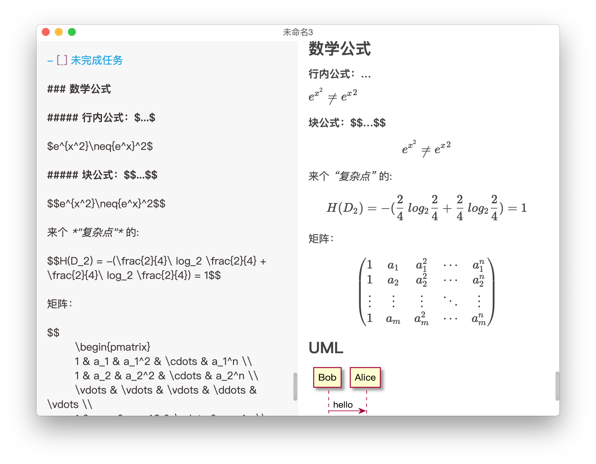

<h1 align="center">JustWrite (Typora Plus)</h1>

 

**有了Typora为什么还要有JustWrite？**

因为Typora太过国际化，在国内水土不服，无法满足我的一些需求。

**JustWrite做了什么增强？**

整体上：
- [x] 跨平台Markdown编辑器（mac、windows）
- [x] 增强微信公众号文章排版，多种主题和代码块样式，一键复制手动粘贴
- [x] 使用Markdown编写个人简历，使用[emoji](http://m.fhdq.net/emoji/emojifuhao.html)表情，导出为PDF文件
- [x] 一键发布文章到博客园、CSDN、SegmentFault、掘金、开源中国等平台

细节上：
- [x] 支持数学公式（行内公式和块公式）
- [x] 支持UML图（参考<http://www.plantuml.com/>）
- [x] 支持自定义图片大小（用法：\）
- [x] 通过{}自定义HTML标签的属性或CSS样式，是让你可以通过Markdown做个人简历的基础。
- [x] 支持多种写作字体，并可调节字体大小。
- [x] 支持夜间模式，保护你的眼睛。
- [x] 提供字数统计功能，功能仿微信公众号。
- [x] 支持全屏写作（即关闭右半侧实时预览）

针对痛点的图片问题，提供了多种解决方法：

- [x] 支持复制粘贴或拖拽图片插入到编辑器
- [x] 一键网络图片下载到本地以文件名命名的文件夹
- [x] 一键本地图片整理至以文件名命名的文件夹，并通过相对路径引用
- [x] 一键上传本地图片到新浪微博图床（虽说免费图床不稳定，不过临时用用还不错）
- [x] 登录新浪微博后，可以开启自动上传。

如果帮助到你了，请帮忙点亮[Github](https://github.com/yueshutong/JustWrite)右上角小星星，这将是我持续更新的动力！

## 下载

Github：<https://github.com/yueshutong/JustWrite/releases>

Gitee：<https://gitee.com/zyzpp/JustWrite/releases> 

## 预览

## 视频演示

<https://www.bilibili.com/video/av78534183/>

## 鸣谢

李晨阳（图标创作者，QQ：1003737038）

## 反馈

唯一反馈建议地址：<https://github.com/yueshutong/JustWrite/issues>

## About

Email：[yster@foxmail.com](mailto:yster@foxmail.com)

如果帮助到你了，请不吝赞赏！谢谢！

