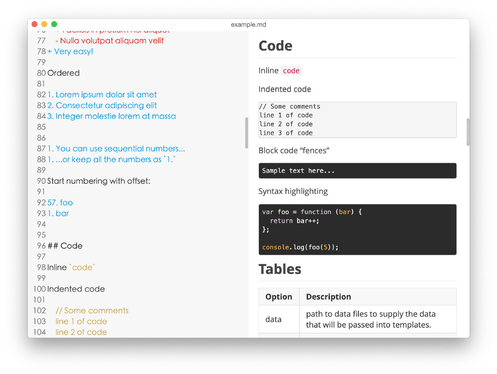
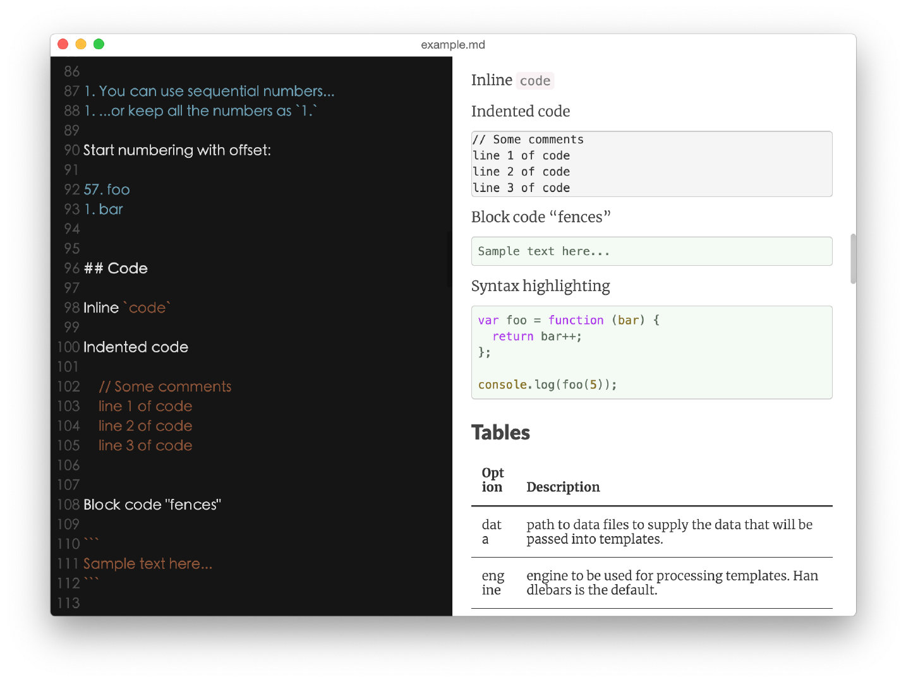

# JustWrite 

 

一款定位于Markdown文章排版与一键发布本地文章到【博客园】【CSDN】【SegmentFault】【掘金】【开源中国】等平台的多标签Markdown编辑器。

你可以尝试用JustWrite写作，因为JustWrite可以帮你排版，帮你美化，帮你处理本地图片，帮你一键发布！

如果帮助到你了，请帮忙点亮[Github](https://github.com/yueshutong/JustWrite)右上角小星星，这将是我持续更新的动力！

## 视频：一键发布到博客园

<https://www.bilibili.com/video/av75844890/>

## 功能

- [x] 微信公众号排版神器（几十种主题+代码块样式）

- [x] **博客园**、**CSDN**、**掘金**、**SegmentFault**、**开源中国**一键发布（带上传本地图片）

- [x] 网络图片一键下载到本地

- [x] 本地图片一键上传至新浪图床

- [x] 本地图片一键整理至Picture文件夹

- [x] 一键复制Markdown代码

- [x] 一键复制Markdown转后的HTML网页

- [x] 支持**夜间模式**等多种主题，保护眼睛

- [x] 支持图片拖拽到文档，并可自动上传到图床

- [x] 支持图片复制粘贴到文档，并可自动上传到图床

- [x] 支持几十种主题、几十种代码块样式

- [x] 支持一键复制发布到微信公众号等富文本编辑器

- [x] 支持一键解决图床防盗链访问404

- [x] 支持打印、支持一键导出PDF文档

- [x] 支持切换markdown编辑器主题

- [x] 支持编辑器字体放大/缩小

- [x] 支持全屏写作（即关闭右半侧实时预览）

## 下载 mac、window 客户端

Github：<https://github.com/yueshutong/JustWrite/releases>

Gitee：<https://gitee.com/zyzpp/JustWrite/releases> 

## 预览

## 鸣谢

李晨阳（图标创作者，QQ：1003737038）

## 反馈

新项目难免有Bug，我也只是在Mac平台使用，Win平台有Bug欢迎反馈告知！24小时之内修复！

唯一Bug反馈建议地址：<https://github.com/yueshutong/JustWrite/issues>

## About

Blog：<https://yueshutong.cnblogs.com/>

Email：[yster@foxmail.com](mailto:yster@foxmail.com)

Github：<https://github.com/yueshutong/JustWrite>

交流QQ群：781927207

如果帮助到你了，请不吝赞赏！谢谢！

